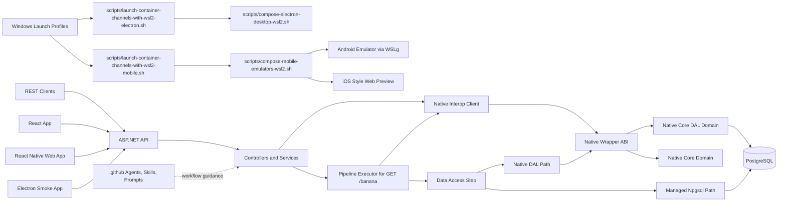
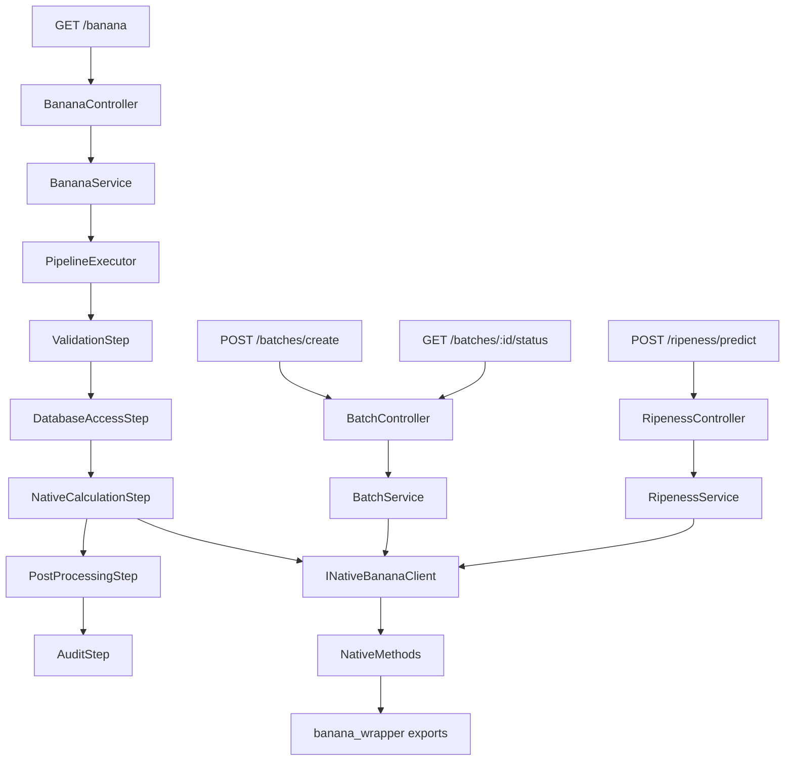
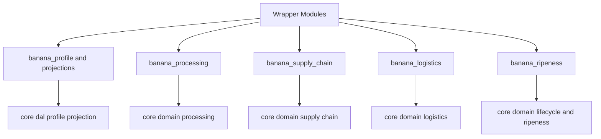

# Architecture Diagrams

> Read the [Wiki Home](Home.md) for more details.

Related pages: [How A Request Works](How-A-Request-Works.md), [Repository Layout](Repository-Layout.md)

This page centralizes the system and request-flow diagrams.

## System Architecture

## HTTP Route Flow

## Native Domain Composition

