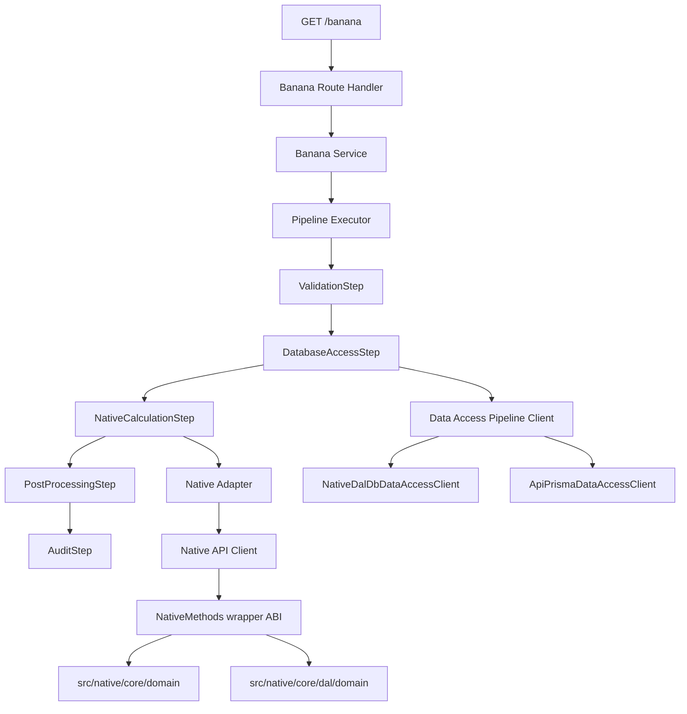

<!-- breadcrumb: Getting Started > How A Request Works -->

# How A Request Works

> [Home](../Home.md) › [Getting Started](README.md) › How A Request Works

Related pages: [Native Wrapper ABI](../architecture/native-wrapper-abi.md), [Database Pipeline Stage](../architecture/database-pipeline-stage.md), [Architecture Overview](../architecture/overview.md)

This page answers one question:

What happens after someone calls an API route?

## Short Answer

The API receives input, calls a route-specific service path, and returns JSON. The banana calculation route uses the full pipeline. Batch and ripeness routes call the same native client through dedicated services.

## Route Inventory

- `GET /banana`: calculation route with pipeline + DB stage + native calculation.
- `POST /batches/create` and `GET /batches/{id}/status`: batch management route through `BatchService`.
- `POST /ripeness/predict`: ripeness prediction route through `RipenessService`.

## Full Walkthrough For GET /banana

1. Request reaches the banana route handler.
2. The route handler calls the banana service.
3. The service creates a pipeline context and executes the ordered pipeline.
4. Pipeline steps execute in order:
   - `ValidationStep`
   - `DatabaseAccessStep`
   - `NativeCalculationStep`
   - `PostProcessingStep`
   - `AuditStep`
5. `DatabaseAccessStep` runs the configured DB client through `IDataAccessPipelineClient`.
6. `NativeCalculationStep` calls `INativeBananaClient`.
7. The route layer writes DB metadata headers:
   - `X-Banana-Db-Contract`
   - `X-Banana-Db-Source`
   - `X-Banana-Db-RowCount`
8. API returns a banana response payload.

## Batch And Ripeness Paths

Batch and ripeness routes do not execute `PipelineExecutor` today.

They call service modules directly:

- `BatchService` calls native batch lifecycle operations (`CreateBatch`, `GetBatchStatus`).
- `RipenessService` validates telemetry input and calls `PredictBatchRipeness`.
- Both go through `INativeBananaClient` and wrapper exports.

## Database Modes For GET /banana

- `NativeDal`: uses wrapper DB projection path.
- `ApiPrisma`: uses API-side Prisma query path.

Both modes share `IDataAccessPipelineClient`, so the rest of the pipeline stays unchanged.

## Important Rules

- API route/service code does not call native internals directly.
- Wrapper owns native memory allocation and free behavior.
- Core domain and DAL domain are internal native modules.
- Keep `BANANA_NATIVE_PATH` explicit for local API runs.

## Where To Debug

- Wrong `/banana` response: start in route handler, service, and pipeline steps.
- Batch or ripeness route issue: start in `BatchService` or `RipenessService`.
- Native loading issue: check `NativeLibraryResolver` and `BANANA_NATIVE_PATH`.
- DB issue: confirm `DbAccess:Mode`, `BANANA_PG_CONNECTION`, and connection-string settings.
- Native behavior mismatch: inspect wrapper exports first, then native core modules.

## Read Next

1. [Native Wrapper ABI](../architecture/native-wrapper-abi.md)
2. [Database Pipeline Stage](../architecture/database-pipeline-stage.md)
3. [First Day Checklist](first-day-checklist.md)
