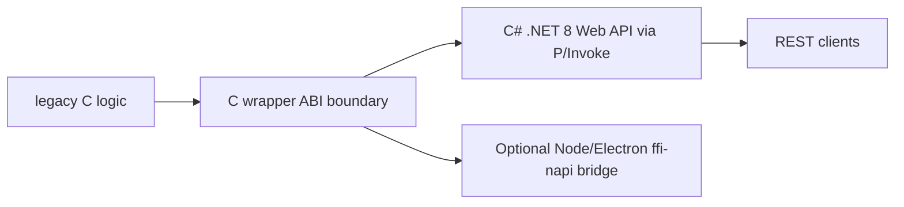

# CInteropSharp

Modernization baseline for a legacy C system without rewriting core logic.

## Architecture



## Repository Structure

```text
src/
  native/
    legacy/
    wrapper/
  api/
    Controllers/
    Services/
    NativeInterop/
  electron/
tests/
  unit/
  integration/
scripts/
docs/
```

## New Developer Setup

- Start with `docs/developer-onboarding.md` for a guided first pass through the codebase.
- Includes a visual request-flow diagram for the controller → pipeline → native interop path.

## Interop Boundary

- Legacy logic remains isolated in `src/native/legacy`.
- Wrapper in `src/native/wrapper` is the only exported native API.
- Wrapper exports primitive signatures and fixed-layout structs.
- Native memory created by wrapper must be released with `cinterop_free`.
- Managed code does not call legacy functions directly.

## Pipeline Pattern (API Orchestration)

The `/points` flow now runs through a composable pipeline inside the API service layer:

```text
Controller
  -> PointsService
      -> PipelineExecutor<PipelineContext>
          1) ValidationStep
          2) NativeCalculationStep (calls existing INativePointsClient / P/Invoke path)
          3) PostProcessingStep (bonus enrichment metadata)
          4) AuditStep (structured logging)
```

Why this was introduced:

- Keeps the legacy/native boundary intact while modernizing orchestration.
- Decouples input rules, native execution, enrichment, and audit concerns.
- Enables additive extension by registering new pipeline steps without changing executor logic.
- Preserves backward compatibility because native bindings and wrapper ABI are unchanged.

Extension points:

- Implement `IPipelineStep<PipelineContext>` in `src/api/Pipeline/Steps`.
- Set `Order` to control deterministic execution.
- Register the step in DI (`Program.cs`) as `IPipelineStep<PipelineContext>`.

## Developer Walkthrough (Start Here)

If you are new to middleware/pipeline patterns, read these files in order:

1. `src/api/Controllers/PointsController.cs`
  - Accepts HTTP input and calls the service.
2. `src/api/Services/PointsService.cs`
  - Builds `PipelineContext` and runs `PipelineExecutor<PipelineContext>`.
3. `src/api/Pipeline/PipelineExecutor.cs`
  - Composes steps into one chain and executes in deterministic order.
4. `src/api/Pipeline/Steps/*`
  - `ValidationStep` → validates input
  - `NativeCalculationStep` → calls native interop
  - `PostProcessingStep` → enrichment logic
  - `AuditStep` → final structured logging
5. `src/api/NativeInterop/*`
  - Contains the P/Invoke boundary and native error mapping.

## Build Native (Windows)

```bat
scripts\build-native.bat
```

Expected output directory:

- `build/native/bin/Release/cinterop_native.dll`

## Build Everything (bash)

```bash
./scripts/build-all.sh
```

## Docker Compose Orchestration

Compose profiles orchestrate runtime and test flows:

- `runtime`: builds native artifact, then starts API
- `tests`: runs unit and integration test containers
- `electron`: runs optional ffi-napi example against native artifact

Run API stack:

```bash
docker compose --profile runtime up --build api
```

Run test flows:

```bash
docker compose --profile tests up --build --abort-on-container-exit --exit-code-from test-all test-all
```

Run optional Electron flow:

```bash
docker compose --profile electron up --build --abort-on-container-exit --exit-code-from electron-example electron-example
```

Convenience wrappers:

```bash
./scripts/compose-runtime.sh
./scripts/compose-tests.sh
./scripts/compose-electron.sh
```

## CI (GitHub Actions)

On every push, CI runs the same compose profiles used locally:

- `tests` profile via `test-all`
- `runtime` profile with `/points` endpoint smoke test
- `electron` profile optional bridge smoke test

Workflow file:

- `.github/workflows/compose-ci.yml`

## Run API

```bash
export CINTEROP_NATIVE_PATH="$(pwd)/build/native/bin/Release"
./scripts/run-api.sh
```

Open Swagger:

- `http://localhost:5000/swagger` or `https://localhost:5001/swagger`

Example endpoint:

- `GET /points?purchases=10&multiplier=2`

## Optional Node/Electron Bridge

For `ffi-napi` compatibility, use Node 14/16 for local non-container runs.

```bash
cd src/electron
npm install
CINTEROP_NATIVE_PATH="$(pwd)/../../build/native/bin/Release" npm run example
```

## Tests

```bash
dotnet test tests/unit/CInteropSharp.UnitTests.csproj
dotnet test tests/integration/CInteropSharp.IntegrationTests.csproj
```

Integration tests call the real API and native wrapper. Build native artifacts first.

## Coverage

Run coverage locally with the built-in `XPlat Code Coverage` collector:

```bash
dotnet test tests/unit/CInteropSharp.UnitTests.csproj -c Release --collect:"XPlat Code Coverage" --results-directory .artifacts/test-results/unit
dotnet test tests/integration/CInteropSharp.IntegrationTests.csproj -c Release --collect:"XPlat Code Coverage" --results-directory .artifacts/test-results/integration
```

CI/CD (`.github/workflows/compose-ci.yml`) now runs unit and integration tests with coverage, then publishes:

- `test-results` artifact (`.trx` + raw coverage files)
- `coverage-report` artifact (Cobertura + HTML + text summary)
