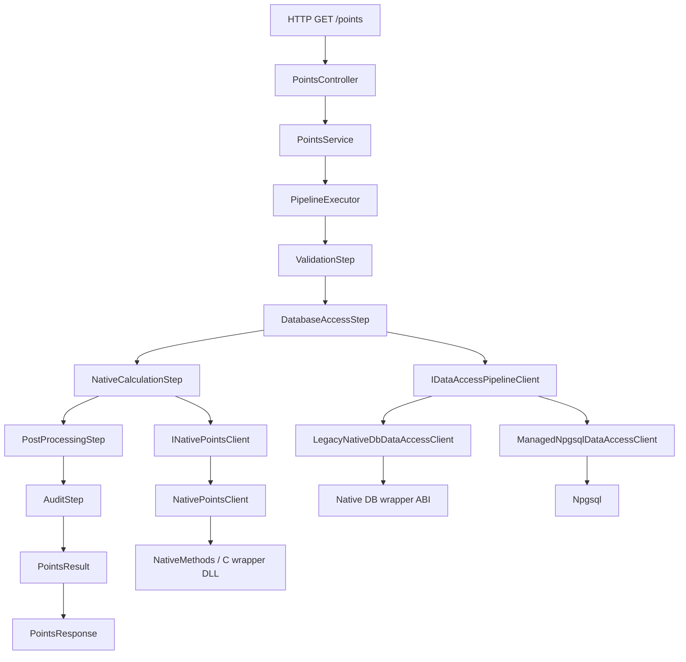

# Architecture

## Intent

This repository modernizes a legacy C codebase by wrapping it with a stable ABI and exposing it through a .NET 8 Web API.
Legacy C remains untouched and isolated behind a dedicated wrapper boundary.

## Layers

- `src/native/legacy`: existing stable C logic (no direct managed consumption)
- `src/native/wrapper`: C ABI-safe exports, validation, and memory ownership rules
- `src/native/testing`: native hook interface + production default hook implementation
- `src/api`: ASP.NET Core Web API + P/Invoke adapter
- `src/electron`: optional ffi-napi bridge
- `tests`: unit and integration suites

## Request Flow

The `/points` endpoint follows this sequence:

1. `PointsController` accepts query parameters.
2. `PointsService` builds a `PipelineContext`.
3. `PipelineExecutor<PipelineContext>` runs ordered steps:
	- `ValidationStep`
	- `DatabaseAccessStep`
	- `NativeCalculationStep`
	- `PostProcessingStep`
	- `AuditStep`
4. Native interop is executed through `INativePointsClient` / `NativePointsClient`.
5. Result is mapped to `PointsResponse` and returned.

This keeps transport, orchestration, interop, and enrichment responsibilities separated.

## Database Access Pipeline Stage

When PostgreSQL integration is required, database interaction is treated as a dedicated pipeline stage.
The stage is atomic at the pipeline level: input mapping, query execution, raw result capture, and context write-back happen inside one step.

### Legacy Path: Native C PostgreSQL

- Implemented by `LegacyNativeDbDataAccessClient`.
- SQL ownership remains in native C code.
- C# code does not reimplement legacy SQL logic.
- Goal is behavior preservation and minimal migration risk.

### Modern Path: Managed Npgsql

- Implemented by `ManagedNpgsqlDataAccessClient`.
- Enabled through configuration mode switching.
- SQL ownership moves to managed code for this path.
- Goal is easier maintainability and observability for future evolution.

## Tradeoffs

- Performance:
	- Native path can preserve existing optimized behavior and avoid query-logic drift.
	- Managed path can perform well with pooling, but parity must be validated.
- Maintainability:
	- Native path minimizes immediate disruption but keeps interop complexity.
	- Managed path improves .NET-first operability and onboarding.
- Risk:
	- Native path is lower regression risk because SQL behavior stays in legacy layer.
	- Managed path introduces migration risk; use runtime switch for safe rollout and rollback.

## Boundary Rules

- Managed code only calls `src/native/wrapper` exports.
- Wrapper translates input validation and status outcomes.
- Wrapper owns native allocation and publishes a dedicated free API.
- No internal legacy headers are exposed to C# or Node.

## Native Test Hook Separation

- Test-only branch forcing is separated from runtime legacy sources.
- Runtime native target (`cinterop_native`) links `src/native/testing/native_test_hooks_default.c`.
- Native test target (`native_wrapper_tests`) links `tests/native/native_test_hooks_env.c`.
- This keeps production sources free of test env parsing while preserving deterministic branch coverage controls in tests.

## Quality Gates

- CI/CD executes native C, .NET unit, and .NET integration suites on every push.
- PostgreSQL is provisioned in CI jobs that exercise native DB paths, with explicit `CINTEROP_PG_CONNECTION` configuration.
- Coverage is collected for native C and .NET test projects.
- CI publishes test and coverage artifacts for auditability:
	- `native-c-coverage` (native XML + text summary)
	- `test-results` (TRX + raw coverage output)
	- `coverage-report` (Cobertura, HTML report, text summary)

## Documentation Standards

- Core classes in `src/api` use XML doc comments (`///`) to explain intent, inputs, and outputs.
- New pipeline steps should include:
	- a class summary describing business purpose,
	- method/parameter docs for `Execute`,
	- clear `Order` rationale when sequence is important.
