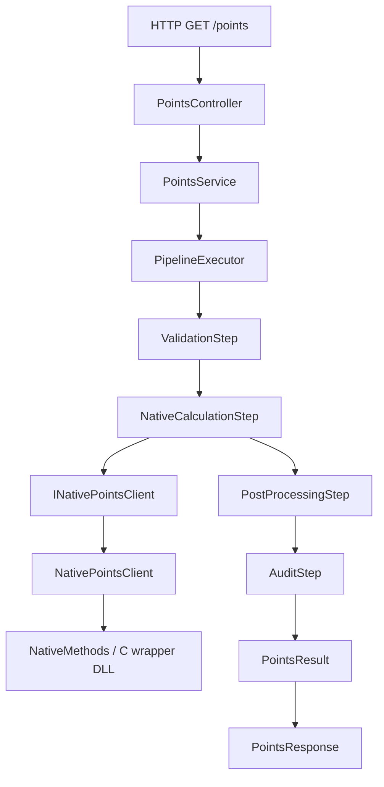

# Architecture

## Intent

This repository modernizes a legacy C codebase by wrapping it with a stable ABI and exposing it through a .NET 8 Web API.
Legacy C remains untouched and isolated behind a dedicated wrapper boundary.

## Layers

- `src/native/legacy`: existing stable C logic (no direct managed consumption)
- `src/native/wrapper`: C ABI-safe exports, validation, and memory ownership rules
- `src/api`: ASP.NET Core Web API + P/Invoke adapter
- `src/electron`: optional ffi-napi bridge
- `tests`: unit and integration suites

## Request Flow

The `/points` endpoint follows this sequence:

1. `PointsController` accepts query parameters.
2. `PointsService` builds a `PipelineContext`.
3. `PipelineExecutor<PipelineContext>` runs ordered steps:
	- `ValidationStep`
	- `NativeCalculationStep`
	- `PostProcessingStep`
	- `AuditStep`
4. Native interop is executed through `INativePointsClient` / `NativePointsClient`.
5. Result is mapped to `PointsResponse` and returned.

This keeps transport, orchestration, interop, and enrichment responsibilities separated.

## Boundary Rules

- Managed code only calls `src/native/wrapper` exports.
- Wrapper translates input validation and status outcomes.
- Wrapper owns native allocation and publishes a dedicated free API.
- No internal legacy headers are exposed to C# or Node.

## Quality Gates

- CI/CD executes unit and integration suites on every push.
- Coverage is collected for both test projects using `XPlat Code Coverage`.
- CI publishes test and coverage artifacts for auditability:
	- `test-results` (TRX + raw coverage output)
	- `coverage-report` (Cobertura, HTML report, text summary)

## Documentation Standards

- Core classes in `src/api` use XML doc comments (`///`) to explain intent, inputs, and outputs.
- New pipeline steps should include:
	- a class summary describing business purpose,
	- method/parameter docs for `Execute`,
	- clear `Order` rationale when sequence is important.
