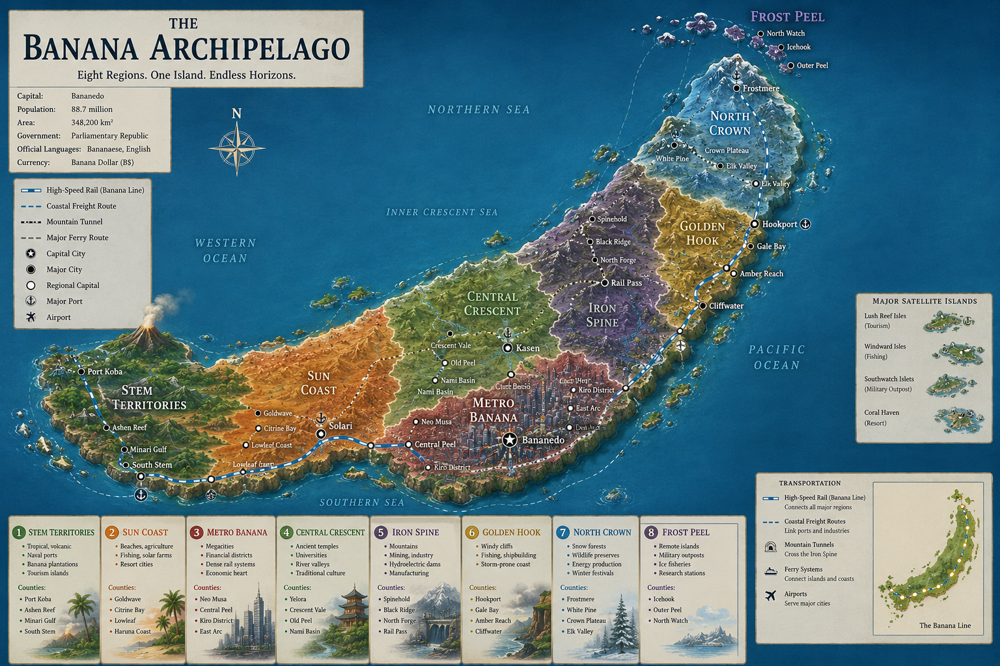

# Banana Archipelago Worldbuilding Baseline

## Purpose
This document defines the canonical worldbuilding baseline for The Banana Archipelago and is written to be scaffold-friendly for future terrain and asset generation in a persistent world.

## One-Line Pitch
A nation shaped like a curved banana island: tropical and volcanic at the stem, hyper-urban in the central arc, mountainous in the spine, and cold/wild at the tip and outer northern islands.

## Visual Anchor

Primary concept art asset:



Usage policy for world scaffolding:
- Use this image as the visual composition anchor for biome adjacency, coastline rhythm, and transport silhouette.
- Use this document as canonical text authority for region/county naming and political hierarchy when image labels differ.
- Preserve eight-region structure and the curved mainland profile as hard constraints for terrain generation.

Known naming drift handling:
- If image labels vary slightly from text canon (for example Lowleaf Coast vs Lowleaf), keep text canon in generated metadata and treat image text as stylistic.

## Core Geographic Identity
- Primary landmass: one long curved island (southwest to northeast), visually banana-like.
- Satellite islands: distributed around the main curve with larger separated island clusters to the far south and far north.
- Directional logic:
  - Southwest stem: tropical, maritime, volcanic.
  - Middle arc: densest settlements, finance, transit, industry.
  - Northeast tip: colder, forested, rugged, fisheries.

## Macro Region Map (Conceptual)

```text
                [ Frost Peel ]
                     /\
                    /  \
         [North Crown]  \
                 \       \
                  \       [Golden Hook]
                   \
                    \
          [Central Crescent]
               |       |
      [Metro Banana] [Iron Spine]
               |
         [Sun Coast]
              /
      [Stem Territories]
```

## National Administrative Model
- Nation: Banana Archipelago
- Region: one of 8 major regions
- County/Prefecture: regional subdivisions
- Municipality: city/town/village level

Example hierarchy:
- Nation: Banana Archipelago
- Region: Central Crescent
- County: Yelora
- Municipality: Kasen City

## Regional Canon

### 1) Stem Territories
Equivalent vibe: Okinawa + Kyushu frontier

Characteristics
- Tropical climate
- Active and dormant volcanoes
- Banana plantations
- Naval ports
- Tourism islands

Counties
- Port Koba
- Ashen Reef
- Minari Gulf
- South Stem

Identity
- Historically independent island clans that later unified into the nation.

### 2) Sun Coast
Equivalent vibe: southern Pacific corridor

Characteristics
- Beaches and coastal agriculture
- Fishing economy
- Solar farms
- Resort cities

Counties
- Goldwave
- Citrine Bay
- Lowleaf
- Haruna Coast

Major City
- Solari (beaches, nightlife, seasonal festivals)

### 3) Metro Banana
Equivalent vibe: Tokyo metro corridor

Characteristics
- Megacities
- Dense rail systems
- Financial districts
- Vertical housing

Counties
- Neo Musa
- Central Peel
- Kiro District
- East Arc

Capital
- Bananedo

Population target
- Approximately 45 million in metro zone

### 4) Central Crescent
Equivalent vibe: Kansai cultural center

Characteristics
- Ancient temples and preserved districts
- Universities and archives
- Traditional architecture
- River valleys and fertile inland belts

Counties
- Yelora
- Crescent Vale
- Old Peel
- Nami Basin

Major City
- Kasen (cultural capital)

### 5) Iron Spine
Equivalent vibe: Chubu industrial belt

Characteristics
- Mining corridors
- Hydroelectric dams
- Manufacturing hubs
- Heavy industry
- Continuous mountain chain (the banana ridge)

Counties
- Spinehold
- Black Ridge
- North Forge
- Rail Pass

### 6) Golden Hook
Equivalent vibe: northeastern Pacific coast

Characteristics
- Windy cliffs
- Shipping ports
- Fisheries
- Storm-prone coastline
- Advanced shipbuilding

Counties
- Hookport
- Gale Bay
- Amber Reach
- Cliffwater

### 7) North Crown
Equivalent vibe: Hokkaido-like cold interior

Characteristics
- Snow forests
- Wildlife preserves
- Sparse population
- Energy production
- Winter festivals

Counties
- Frostmere
- White Pine
- Crown Plateau
- Elk Valley

### 8) Frost Peel
Equivalent vibe: remote northern frontier islands

Characteristics
- Military outposts
- Ice fisheries
- Research stations
- Harsh weather

Counties
- Icehook
- Outer Peel
- North Watch

## Transportation Canon

### Strategic Infrastructure
- High-speed rail following the banana curve
- Coastal freight routes on both inner and outer coasts
- Mountain tunnel corridors through Iron Spine
- Ferry systems connecting satellite islands

### Main Passenger Spine
1. Stem Territories
2. Sun Coast
3. Metro Banana
4. Central Crescent
5. Golden Hook
6. North Crown

### Movement Rules of Thumb
- East-facing coast: fastest trade throughput
- Inner crescent: strongest agricultural logistics
- Outer crescent: highest storm risk, strongest naval hardening

## Cultural Zonation

- Southwest: relaxed, maritime, clan-rooted identity
- Central arc: hyper-urban, high-speed, globally connected
- Mountain spine: industrial, practical, conservative craftsmanship
- Northeast and outer tip: rugged, resilient, weather-defined communities

## Military and Strategic Geography

Natural choke points
- Narrow northern tip
- Mountain spine dividing east-west travel
- Stem ports controlling southern sea trade
- Interior crescent as defensive and supply heartland

Design implications
- Strong map-level strategic asymmetry
- Clear invasion/defense corridors
- Distinct naval vs inland campaign behavior

## Persistent World Design Implications

### Live World Rhythm
- Regional economies should feel interdependent (ports, manufacturing, agriculture, energy)
- Weather must materially impact routing and event frequency
- Northern and outer regions should feel low-population but high-stakes

### Regional Gameplay Identity
- Stem Territories: exploration, volcanic hazards, maritime logistics
- Sun Coast: tourism, fisheries, renewable infrastructure
- Metro Banana: dense social and economic systems
- Central Crescent: history, institutions, cultural preservation
- Iron Spine: extraction, industry, and rail bottlenecks
- Golden Hook: storms, shipyards, and high-risk ports
- North Crown: survival, wildlife, and winter systems
- Frost Peel: frontier operations and strategic monitoring

## Terrain Scaffolding Inputs

### Elevation Bands
- Coastal lowlands: Stem Territories, Sun Coast, Metro edges
- Mid-elevation basins: Central Crescent valleys
- High mountain spine: Iron Spine backbone
- Cliff and shelf coast: Golden Hook
- Cold plateau and island ridges: North Crown and Frost Peel

### Biome Palette by Region
- Tropical coast, volcanic rock, mangrove lagoon: Stem Territories
- Warm coast, dune beach, cultivated plain: Sun Coast
- Urban plain, reclaimed coast, transport megastructures: Metro Banana
- Temperate valley, river plain, old-growth groves: Central Crescent
- Alpine ridge, quarry zones, industrial foothills: Iron Spine
- Wind coast, storm cliffs, cold fisheries: Golden Hook
- Boreal forest, snowfield, frozen wetlands: North Crown
- Polar maritime islands, ice shelf coast, research enclaves: Frost Peel

### Procedural Generation Tags
Use these tags at region and county level for terrain and asset pipelines.

- climate: tropical | warm-temperate | temperate | alpine | subarctic | polar-maritime
- relief: lowland | basin | ridge | cliff-coast | plateau | island-chain
- hazard: volcanic | seismic | cyclone | blizzard | landslide | rough-sea
- economy: agriculture | fishing | finance | culture | mining | manufacturing | energy | shipbuilding | military | research
- density: sparse | medium | dense | megacity
- infrastructure: rail-hub | freight-port | naval-base | dam-network | tunnel-corridor | ferry-node

## Asset Generation Direction

### Settlement Archetypes
- Port city
- Resort city
- Megacity vertical district
- Temple university town
- Mountain industrial town
- Storm-hardened shipyard port
- Snow plateau service town
- Frontier outpost

### Landmark Archetypes
- Volcano caldera complex
- Coastal rail viaducts
- Capital skyline core
- Historic temple basin
- Mountain dam chain
- Cliff lighthouse fortress
- Winter festival grounds
- Arctic research ring

### Modular Asset Families
- Maritime infrastructure set (docks, cranes, ferries, breakwaters)
- Rail and transit set (stations, elevated lines, tunnels)
- Cultural heritage set (temples, archives, old streets)
- Industrial set (mines, refineries, foundries, logistics yards)
- Defense and monitoring set (coastal batteries, radar, outposts)
- Climate adaptation set (storm shutters, snow roofs, sea walls)

## Naming and Linguistic Guidance
- Preserve region names exactly as canonical labels.
- County and city names should blend coastal, botanical, mineral, and weather cues.
- New generated names should avoid direct real-world country naming but may keep broad East-Asian-inspired cadence.

## Governance Rules for Future Scaffolding
- This document is the source baseline for terrain/asset planning in The Banana Archipelago.
- New regions should not be added without updating this document first.
- Any county-level additions must inherit a parent region and define biome/economy/hazard tags.
- Transport and strategic choke points are mandatory constraints, not optional flavor.

## Open Expansion Hooks
- County-by-county municipality lists
- Regional climate calendar and seasonal hazard matrix
- Port throughput and rail capacity simulation tables
- Cultural event calendar tied to world-state progression
- Faction/control overlays for strategy scenarios
