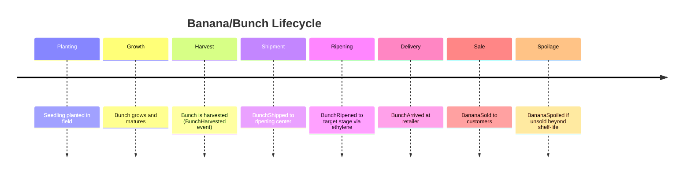

# Domain-Driven Design Analysis of the Banana Domain

**Executive Summary:** In this report we model the concept of a “Banana” through the lens of Domain-Driven Design (DDD). We define a **ubiquitous language** of banana-related terms, identify multiple **bounded contexts** (e.g. cultivation, distribution, retail) with their unique models, and determine which aspects of a banana domain are **entities** or **value objects**. We propose aggregate structures (for example, a *Bunch* aggregate containing *Banana* entities) and list key *invariants*. We enumerate domain *events* (e.g. `BananaHarvested`, `BananaRipened`), *commands* (e.g. `RipenBunch`, `SellBananas`), and describe typical use cases. Repositories (e.g. `BunchRepository`) and persistence strategies (identifiers, consistency) are outlined. We discuss factories for creation rules, domain vs application services, and integration patterns (anti-corruption layers for IoT or retailer systems). We address read models/CQRS (e.g. inventory read views) and validation/invariants (ripeness range, non-zero counts).  To illustrate, we include example mermaid diagrams (relationships and a timeline) and pseudocode snippets for entities, value objects, events, and a repository interface. All definitions align with core DDD sources【2†L88-L92】【11†L65-L73】【20†L331-L339】. The conclusion highlights recommended next steps for modeling bananas in software.

## Ubiquitous Language

We first establish a *ubiquitous language* – a shared vocabulary of terms that domain experts and developers use consistently【2†L88-L92】. For example:

- **Banana (fruit):** The edible fruit produced by a banana plant. Key attributes: *variety* (e.g. Cavendish, Ladyfinger), *ripeness* (scale 1–7), *weight*, *color*, *length*.  
- **Bunch:** A group of bananas growing together on a single stem. Has an *ID*, *count* of bananas, *harvest date*, *location*.  
- **Cultivar/Variety:** The specific genetic variety of banana. E.g. “Cavendish.” Usually treated as an immutable **value object** (two references to the same cultivar are identical)【20†L331-L339】.  
- **Plantation/Field:** The farm or plot where bananas grow.  
- **Harvest:** The act of picking a bunch of bananas.  
- **Shipment/Delivery:** Transport of bananas (or bunches) from one location (farm, distribution center, store).  
- **Ripening:** The process of a banana changing color and sweetness (often controlled using *ethylene gas*). Ripeness is measured on a scale (e.g. 1 = green, 7 = fully yellow).  
- **Retail Item:** The inventory entry for a banana or bunch in a store.  
- **Consumer:** End user/customer buying and eating bananas.  

The following table provides sample definitions in context:

| **Term**     | **Definition**                                                                                   |
|--------------|--------------------------------------------------------------------------------------------------|
| *Banana*     | An individual fruit (may or may not have its own ID) of a given variety, weight, and ripeness.  |
| *Bunch*      | A collection of Bananas on one stem; has identity and lifecycle (planting→growth→harvest→sale). |
| *Ripeness*   | An attribute (1–7) representing maturity. Often a **value object** (two bananas with stage=3 are equivalent).       |
| *Cultivar*   | Banana variety (Cavendish, Plantain, etc.). A static **value object**.                            |
| *Farm/Field* | Physical location or identifier of where bananas are grown (e.g. GPS coordinate).                |
| *Shipment*   | Movement of one or more bunches/containers, with origin, destination, carrier, date.            |
| *Inventory*  | The count/stock of bananas in a location (retailer, warehouse).                                  |
| *Spoilage*   | The state or event of over-ripeness; bananas beyond usable stage.                                 |

Using this ubiquitous language in all code and discussions ensures clarity【2†L88-L92】【6†L99-L107】.

## Bounded Contexts and Domain Contexts

A large “banana system” naturally divides into distinct **contexts**, each with its own model and terminology【6†L94-L103】. Examples:

- **Cultivation Context (Agriculture):** Involves *farmers*, *fields*, *planting*, *growth conditions*, *variety selection*. Responsibilities: tracking plant health, scheduling planting/harvest, breeding new cultivars. Entities: *Field*, *Seedling*, *Farm*. Value objects: *SoilConditions*, *Coordinates*.  
- **Harvesting/Processing Context:** Focuses on picking *bunches* from the field, sorting, washing, packing. Responsibilities: scheduling harvest, quality inspection, assigning *batch numbers*. Entities: *Bunch* (aggregate root), *Crate*, *Inspector*. Value objects: *Dimensions* (bunch size), *HarvestDate*.  
- **Logistics/Distribution Context:** Covers transporting bananas from farms to distribution centers and retailers. Terms: *Shipment*, *RipeningRoom*, *Warehouse*. Responsibilities: routing shipments, controlling ripening (using *ethylene* levels), tracking *ripeness stage*. Entities: *Shipment* (aggregate root), *RipeningRoom*, *Container*. Value objects: *Temperature*, *CurrentLocation*.  
- **Retail/Inventory Context:** Manages stock and sales in grocery stores. Terms: *RetailInventoryItem*, *Order*, *Shelf*. Responsibilities: ordering bananas from suppliers, displaying ripeness levels, processing sales. Entities: *InventoryItem*, *Order*. Value objects: *Price*, *Barcode*.  
- **Consumer Context (End-User/Order):** User’s interaction (buying, eating). Terms: *Customer*, *Recipe*, *NutritionInfo*. Responsibilities: preferences (ripe vs green), nutritional tracking. Possibly out of core system scope.

Each bounded context has **its own model and ubiquitous language**【6†L99-L107】.  For example, in the Logistics context “ripening” is a process with a *targetStage* and uses sensors, whereas in Retail context “ripe” is a stock attribute. We might map these via anti-corruption layers when integrating.

<table>
<caption><b>Example Bounded Contexts for Bananas</b></caption>
<tr><th>Context</th><th>Key Entities/Concepts</th><th>Responsibilities</th></tr>
<tr><td>Cultivation (Farming)</td><td>Field, Farm, BananaPlant, SoilCondition (VO), Cultivar (VO)</td><td>Manage planting schedules, track growth, irrigation, fertilization, detect diseases</td></tr>
<tr><td>Harvest & Processing</td><td>Bunch (Aggregate root), HarvestBatch, Crate, Inspector</td><td>Schedule harvest, inspect quality, pack bananas, assign lot numbers, transport to cold storage</td></tr>
<tr><td>Logistics & Distribution</td><td>Shipment (Aggregate root), Container, RipeningRoom, Truck</td><td>Plan shipments, control temperature/ethylene, track location, update ripeness stage, comply with shipping regs</td></tr>
<tr><td>Retail/Inventory</td><td>InventoryItem, Order, StoreSection</td><td>Stocking bananas by ripeness, sales, returns, reorder from supplier, price management</td></tr>
<tr><td>Consumer/Aftermarket</td><td>PurchaseOrder, ConsumptionEvent, Recipe, NutritionalInfo (VO)</td><td>Place orders, consume bananas, log recipes and health impact (rare in core banana system)</td></tr>
</table>

These contexts may overlap in concepts (e.g. *Banana* appears in each) but each uses its own model and definitions【6†L99-L107】【20†L263-L272】. Integration patterns (e.g. *Customer-Supplier*, *Shared Kernel*, or an *Anti-Corruption Layer*) handle translation across contexts【22†L49-L53】.

## Entities vs Value Objects

In DDD, **entities** have identity and lifecycle, while **value objects** are immutable and distinguished only by their attributes【20†L331-L339】.

| **Aspect**              | **Entity / VO**      | **Justification**                                                                             |
|-------------------------|----------------------|-----------------------------------------------------------------------------------------------|
| *Banana (individual)*   | **Entity (maybe)**   | If tracked individually (e.g. in lab/quality), has an ID. In many contexts bananas are fungible, but as part of a *Bunch* aggregate we treat each banana with an identity.            |
| *Bunch*                 | **Entity (Aggregate Root)** | The bunch has a unique ID, created at harvest. It contains many Bananas. It is the root of the aggregate (all modifications go through the bunch)【11†L69-L77】.                   |
| *Cultivar/Variety*      | **Value Object**     | Two references to “Cavendish” are semantically identical. Immutable and no inherent ID【20†L331-L339】.                                           |
| *Ripeness Level*        | **Value Object**     | An integer or enum (1–7). Identical values mean identical state.                                  |
| *Weight, Dimensions*    | **Value Object**     | Attributes of a banana/bunch (e.g. weight in kg). No identity beyond the values.                  |
| *GPS Location / Coordinates* | **Value Object** | Pure data (latitude/longitude). If two locations have same coordinates, they are equal.           |
| *Shipment*              | **Entity (Aggregate Root)** | Has unique ID, contains many bunches or containers.                                          |
| *Farm/Field*            | **Entity**           | Unique location name or code with identity.                                                    |
| *Date/Time stamps*      | **Value Object / Primitive** | Immutable values (no identity).                                                           |
| *Quantity (Count of bananas)* | **Primitive/Value** | Just a number. Possibly wrapped as a value object for validation (non-negative).                |

Entities: Bunch, Shipment, Field, InventoryItem, etc. Value Objects: Ripeness, Weight, Cultivar, Location, etc. Primitive types (string, number) can be used where appropriate (e.g. weight could be a float).

For example, a `Banana` entity might have a *BananaId*, mutable ripeness and weight, while its *Cultivar* and *Dimensions* are value objects.  Per Evans: “if creation of an entire, internally consistent aggregate or a large value object becomes complicated…use a factory.” We will define factories accordingly【17†L442-L450】.

## Aggregates and Aggregate Roots

Aggregates enforce **consistency boundaries**【11†L75-L83】: all invariants inside the aggregate must hold at transaction end. We propose:

- **Bunch Aggregate:** *Aggregate Root:* `Bunch`. *Entities:* `Banana` (child entity), possibly `Stem`. *Value Objects:* ripeness stage, weight, variety (could be in Bunch or Banana). *Invariants:* 
  - A Bunch must have at least one Banana. 
  - The sum of individual Banana weights equals Bunch weight. 
  - All Bananas in a Bunch share the same variety. 
  - Bananas’ ripeness levels are normally uniform (or within one stage) when harvested.
  - Bunch state transitions follow: *Planted → Growing → Harvested → Ripening → Sold/Spoiled*. 
- **Shipment Aggregate:** *Root:* `Shipment`. Contains references to one or more Bunches. *Invariants:* A Shipment cannot ship the same Bunch twice; must have departure and destination; if multi-carrier, track each leg.

- **Inventory Aggregate (Retail):** *Root:* `InventoryItem` (or `ProductStock`). Contains quantity of bananas or bunches, location. *Invariants:* quantity ≥ 0; reorder threshold triggers on low stock.

#### Example Aggregate Diagram (Bunch and Banana)
```
classDiagram
    class Bunch {
      +BunchId id
      +RipenessStage stage
      +DateTime harvestDate
      +float totalWeight
      +addBanana(Banana)
      +setRipeness(RipenessStage)
    }
    class Banana {
      +BananaId id
      +RipenessStage stage
      +float weight
    }
    Bunch "1" o-- "*" Banana
```
*(Mermaid class diagram: Bunch aggregate root contains multiple Bananas.)*

The **aggregate root** (e.g. `Bunch`) is the only object accessible externally; internal `Banana` entities are manipulated via the Bunch. This enforces invariants: e.g., when ripening a bunch, the Bunch root updates all contained Bananas’ stages consistently【11†L81-L85】【20†L341-L347】.

## Domain Events

Key domain events (“something happened” in the domain) might include【15†L68-L72】【20†L339-L347】:
- `BananaPlanted(fieldId, variety, time)`: Triggered when a new plant is set in the field. Payload: field ID, cultivar, timestamp.
- `BananaBloomed(bunchId, date)`: Banana flower bloom event (internal farming context).
- `BunchHarvested(bunchId, timestamp)`: A bunch was picked. Payload: Bunch ID, variety, harvest date.
- `BunchShipped(shipmentId, bunchId, from, to, date)`: Triggered when a Bunch is loaded for shipment. 
- `BunchArrived(shipmentId, bunchId, location, date)`: Arrived at destination.
- `BunchRipened(bunchId, newStage, timestamp)`: Ripening stage updated (often by a ripening room sensor).
- `BananaSold(storeId, bunchId, quantity, date)`: Some bananas sold at retail.
- `BananaSpoiled(bunchId, stage, date)`: Bananas have passed shelf-life (triggered by business rule).
  
Each event includes relevant payload (IDs, timestamps, state). Domain events are used for internal side-effects (inventory updates, notifications) within the same context【15†L93-L102】. When communicating between bounded contexts (e.g. logistics→retail), these might be mapped to **integration events** (with translation via anti-corruption layer).

## Commands and Use Cases

Typical **commands** (intents) in the banana domain include:

- `HarvestBunch(bunchId)`: Initiate picking a Bunch when ready. *Precondition:* Bunch is mature (ripeness== harvest threshold). *Postcondition:* Bunch state changes to *Harvested*; emits `BunchHarvested`.  
- `ShipBunch(bunchId, toLocation)`: Send a harvested bunch to a DC or retailer. *Pre:* Bunch has been harvested; a Shipment created. *Post:* Bunch assigned to Shipment; emits `BunchShipped`.  
- `RipenBunch(bunchId, targetStage)`: Increase a bunch’s ripeness (e.g., in ripening room). *Pre:* Bunch must be in inventory at distribution center. *Post:* Bunch stage updated; emits `BunchRipened`. Invariant: targetStage ≥ currentStage.  
- `SellBananas(bunchId, quantity)`: Remove bananas from stock as sold. *Pre:* Bunch is in Retail inventory; enough bananas remain. *Post:* Inventory decremented; possibly emits `BananaSold`. If quantity equals bunch count, Bunch considered fully sold or removed.  
- `DiscardSpoiled(bunchId)`: Remove spoilt bananas. *Pre:* Bunch ripeness > 7 or past shelf-life. *Post:* Bunch marked spoiled; emits `BananaSpoiled`.  

Each command is executed by an *application service*, enforcing invariants and calling domain objects. Commands operate at aggregate boundaries; for example, `RipenBunch` acts on the Bunch aggregate, invoking a method on the aggregate root (which updates all child Bananas).

## Repositories and Persistence Strategies

We define repository interfaces for aggregate roots【20†L353-L359】. For example:

```pseudo
interface BunchRepository {
    Bunch findById(BunchId id); 
    void save(Bunch bunch);
}
```

- **Keys:** Aggregates have unique IDs (e.g. `BunchId`, `ShipmentId`).  A `BunchId` might be a GUID or a natural key (e.g. field+date+sequence). Bananas inside a bunch can have IDs (e.g. for quality tracking) or be implicitly identified by index.
- **Consistency:** We assume **strong consistency** within an aggregate: saving a Bunch writes all contained Bananas in one transaction【11†L75-L83】. Across aggregates (different bounded contexts), we use eventual consistency via events (e.g. a shipped bunch event updates inventory later).
- **Persistence:** Could use a relational or document store. One approach: store each aggregate as one document (e.g. Bunch with embedded bananas) or with separate Banana rows keyed by BunchId. Repositories abstract these details.

The native Banana DAL now follows that aggregate-snapshot approach when PostgreSQL is enabled, and it mirrors the main native subdomains under `src/native/core/dal/domain`: `banana_profile_projection` owns the banana profile SQL projection, `banana_cultivation` persists `Plant`, `banana_processing` persists `Bunch`, `banana_supply_chain` persists `Batch` and `Shipment`, and `banana_inventory` persists `InventoryItem`. Those aggregates are stored as whole snapshots in a `banana_domain_aggregates` table keyed by subdomain-aware aggregate types such as `cultivation.plant` and `supply_chain.batch`. This keeps writes atomic at the repository boundary while preserving the current in-memory fallback when PostgreSQL is unavailable.

For read-optimized queries, we might use **CQRS**: read models can denormalize data (e.g. a *BananaInventoryView* aggregated by store and ripeness). Domain events update these read tables asynchronously.

## Factories and Creation Rules

Complex creation logic is encapsulated in **factories**【20†L353-L359】. For example, a `BunchFactory` might enforce that all Bananas in a new Bunch come from the same seedling on the same date:

```pseudo
class BunchFactory {
    static Bunch createNew(fieldId, cultivar, harvestDate, bananaSpecs[]): Bunch {
         // bananaSpecs: list of (weight, initialRipeness)
         assert(bananaSpecs.size > 0);
         Bunch bunch = new Bunch(new BunchId(), fieldId, cultivar);
         foreach spec in bananaSpecs:
             bunch.addBanana(new Banana(new BananaId(), spec.weight, spec.ripeness));
         bunch.setHarvestDate(harvestDate);
         return bunch;
    }
}
```

*Creation rules:* e.g. cannot create a Bunch with zero bananas or negative weight, and all bananas must share the same cultivar and harvest date. These checks happen in the factory or aggregate constructor.

## Domain Services vs Application Services

- **Domain Services:** Encapsulate domain logic not naturally belonging to an entity. E.g. a `RipeningService` that contains an algorithm to determine ripeness progression based on time and temperature. Or a `QualityControlService` that scores a bunch. Domain services do domain-specific work but are stateless (no identity)【20†L360-L362】.
  
- **Application Services:** Coordinate use cases and transactions. They handle commands (e.g. `HarvestBunchCommandHandler`), retrieve aggregates from repositories, call domain methods, and commit changes. They may also publish domain events after a transaction.

For example: A *HarvestBananaUseCase* (application service) loads a *Plantation* or *Plant* aggregate, determines which Bunches are ripe, and issues `HarvestBunch` commands on those Bunch aggregates.

## Anti-Corruption Layers and Integration Patterns

Banana systems often integrate with external or legacy systems:
- **Supply Chain Systems:** May use an ACL to map an external ERP’s *ProductCode* to our Banana model. For instance, the retailer’s system calls our `UpdateInventory` API; behind the scenes an ACL translates its data schema to our domain events.
- **IoT Sensors:** Sensors in a ripening room produce readings (temperature, ethylene). A *SensorAdapter* service converts sensor data (e.g. message queue) into domain commands/events (`SetRipeningConditions`, `BunchRipened`).
- **Third-Party Services:** Example: A weather service might inform growing conditions. An ACL or API translates weather data into domain actions (e.g. schedule irrigation).
  
These patterns shield the banana domain model from external changes【22†L49-L53】. For example, an **Anti-Corruption Layer** can map the retailer’s “banana inventory” concept to our `InventoryItem` aggregate, translating field names and units as needed.

Integration can use **context mapping**: e.g. a *Shared Kernel* if two banana subteams agree on a small common model (like cultivar definitions), or *Conformist* where one side adapts to the other. For cross-context data, use **domain events** vs **integration events** as appropriate【15†L99-L107】.

## Read Models, Queries, and CQRS

For reporting, we use separate **read models**. Examples:
- *BananaStockView:* Summarizes count of bananas by ripeness per store.
- *AverageRipenessReport:* Tracks how many shipments have reached certain ripeness stages.
- *CultivarStats:* Total weight of each cultivar sold this month.

These read models are updated by listening to domain events. For instance, a `BunchRipened` event might update *BananaStockView* by moving counts from one stage bucket to another. This follows CQRS patterns: command side (write) is normalized and strict, query side (read) is denormalized for fast queries.

## Validation, Business Rules, Invariants

Important rules/invariants include:
- **Ripeness Range:** Ripeness stage must remain within [1..7]. Attempts to exceed 7 trigger spoilage rules.
- **Non-negative counts:** Number of bananas in a bunch, weight of bananas, and inventory quantities must be ≥ 0.
- **Consistency:** When a Bunch is harvested, all child bananas share the same harvest date and initial ripeness stage.
- **Single Responsibility:** A Bunch cannot be in two places at once. At most one active Shipment association per Bunch at a time.
- **Ownership:** Only a Bunch’s aggregate root may modify its child bananas. For example, you cannot remove one Banana from a Bunch without going through a `removeBanana()` method on the Bunch.
- **Transactional Boundaries:** Each aggregate update is atomic. For example, ripening a bunch (root) atomically updates the stage of all bananas in that bunch. If we ripen multiple bunches (multiple aggregates), we use eventual consistency (separate transactions).

All invariants are enforced inside aggregates or by domain services before committing changes.

## Example Diagrams

**Bounded Context Map:** (*illustrative, not from a source*)  
```mermaid
flowchart LR
  subgraph Cultivation
    A[Field] --> B[Plant]
    B --> C[Bunch]
  end
  subgraph Harvesting
    C --> D[Bunch (Harvested)]
    D --> E[Crate]
  end
  subgraph Distribution
    E --> F[Shipment]
    F --> G[RipeningRoom]
  end
  subgraph Retail
    G --> H[Store Inventory]
  end
  H --> I[Consumer]
  A -. "requests ripening" .-> G
```
*(Mermaid flowchart: shows banana lifecycle through contexts: Field→Plant→Harvest→Shipment→Store.)*  

**Bunch Lifecycle Timeline:**  

*(Mermaid timeline: shows chronological banana life events.)*

## Example Code Snippets

Below are illustrative pseudocode snippets:

```
// Entity: Bunch Aggregate Root
class Bunch {
    BunchId id;
    List<Banana> bananas;
    RipenessLevel stage;     // aggregate-wide ripeness (1..7)
    DateTime harvestDate;
    // domain methods
    void addBanana(Banana b) { /*...*/ }
    void setRipeness(RipenessLevel newStage) {
        assert(newStage >= stage);
        stage = newStage;
        // update all child bananas
        for (Banana b : bananas) b.stage = newStage;
        // raise Domain Event
        DomainEvents.raise(new BunchRipenedEvent(id, newStage, now()));
    }
}
```

```
// Value Object: RipenessLevel (immutable)
class RipenessLevel {
    int level;  // 1..7
    constructor(level) {
        assert(level >= 1 && level <= 7);
        this.level = level;
    }
    equals(other) { return other instanceof RipenessLevel && this.level == other.level; }
}
```

```
// Domain Event
class BunchRipenedEvent {
    BunchId bunchId;
    RipenessLevel newStage;
    Timestamp occurredOn;
    constructor(bunchId, newStage, time) { /*...*/ }
}
```

```
// Repository interface
interface BunchRepository {
    Bunch getById(BunchId id);
    void save(Bunch bunch);
}
```

```
// Domain Service (example)
class QualityControlService {
    // Checks if average banana weight < threshold
    bool isUnderweight(Bunch bunch) {
        double avg = bunch.bananas.average(b -> b.weight);
        return avg < 0.1; // e.g. grams
    }
}
```

These code examples show how DDD patterns map to code (aggregate methods, raising events, repositories) and align with practices (e.g. only aggregate root persists children)【11†L89-L97】【20†L351-L359】.

## Conclusion

Modeling a banana domain with DDD yields a rich, structured design. We defined a **ubiquitous language** (ripeness, bunch, cultivar, etc.), and identified multiple **bounded contexts** (cultivation, processing, distribution, retail). Key objects were categorized: *Bunch* and *Shipment* as **aggregates**, *Banana* as an entity (inside a bunch) or sometimes a value-type in inventory, and *RipenessLevel*, *Cultivar* as **value objects**【20†L331-L339】. We proposed aggregate boundaries with invariants (e.g. Bunch must have ≥1 banana) and outlined domain **events** (`BunchHarvested`, `BunchRipened`, etc.) with triggers and payloads. Typical **commands** (e.g. `RipenBunch`, `SellBananas`) were described, along with pre/post-conditions. Repositories (`BunchRepository`) abstract persistence (IDs, consistency). We noted **factories** (to create a Bunch or Planting) and services (ripening logic). Integration with external systems (IoT, retailers) can use anti-corruption layers【22†L49-L53】. We also covered CQRS/read models for inventory views, and validation rules (ripeness range, non-negative weights) to enforce invariants.

**Next Steps:** In a software project, one would refine this model by engaging domain experts (farmers, distributors, retailers) to validate terms and rules. Build bounded contexts independently (with APIs or events to integrate). Implement core aggregates and repositories, starting with a central context (e.g. harvesting), and gradually connect others. Use the ubiquitous language in code and discussions to ensure consistency. The diagrams and examples here serve as a conceptual foundation; the real model should evolve with feedback, guided by DDD practices【2†L88-L92】【11†L75-L83】.

