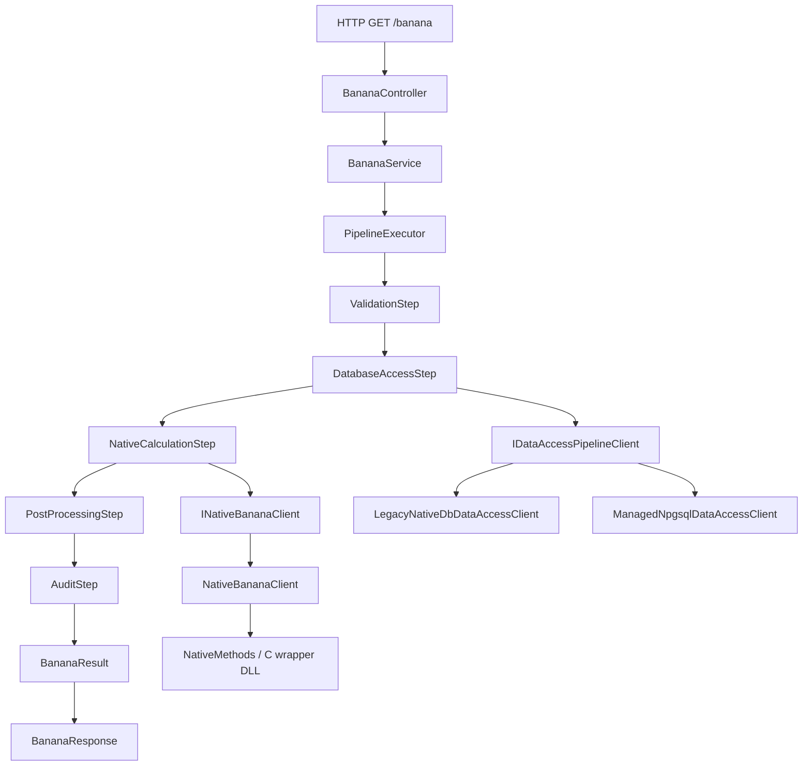

# Developer Onboarding

This guide is for developers who are new to this repository and to C# ↔ native interop patterns.

## First 30 Minutes

1. Read the architecture overview:
   - `docs/architecture.md`
2. Skim the API flow entry files:
   - `src/api/Controllers/BananaController.cs`
   - `src/api/Services/BananaService.cs`
3. Understand pipeline orchestration:
   - `src/api/Pipeline/PipelineExecutor.cs`
   - `src/api/Pipeline/IPipelineStep.cs`
   - `src/api/Pipeline/Steps/*`
4. Inspect native interop boundary:
   - `src/api/NativeInterop/NativeBananaClient.cs`
   - `src/api/NativeInterop/NativeMethods.cs`
   - `src/native/wrapper/*`
5. Run tests locally:
   - `dotnet test tests/unit/CInteropSharp.UnitTests.csproj -c Release`
   - `dotnet test tests/integration/CInteropSharp.IntegrationTests.csproj -c Release`

## Mental Model

- Controller handles transport concerns (HTTP).
- Service handles orchestration concerns (pipeline execution).
- Pipeline steps handle isolated units of work in deterministic order.
- Native interop layer handles P/Invoke and native status translation.
- Middleware handles consistent exception-to-HTTP mapping.

## Request Flow Diagram

Read the diagram left-to-right/top-to-bottom as one request. The API stays decoupled because each step has one job and the executor coordinates order.

## How To Add a New Pipeline Step

1. Create a class in `src/api/Pipeline/Steps` implementing `IPipelineStep<PipelineContext>`.
2. Set an `Order` value for deterministic sequencing.
3. Add XML docs (`///`) for class and `Execute` method.
4. Register in `src/api/Program.cs` as:
   - `services.AddScoped<IPipelineStep<PipelineContext>, YourStep>();`
5. Add unit/integration tests proving behavior and ordering.

## Common Debugging Tips

- If native load fails:
   - Verify `CINTEROP_NATIVE_PATH` targets the directory containing the platform library.
  - Check `NativeLibraryResolver` logs for where loading was attempted.
- If legacy native DB tests fail with not-configured errors:
   - Verify `CINTEROP_PG_CONNECTION` is set and targets a reachable PostgreSQL host/port.
   - In CI, check the "Assert native DB connection target" step output for host/port confirmation.
- If pipeline order looks wrong:
  - Confirm `Order` values.
  - Confirm the step is registered in DI.
- If API returns 500 unexpectedly:
  - Check `ErrorHandlingMiddleware` mappings.
  - Look for `NativeInteropException` vs general exception paths.

## Coverage + CI/CD

- Local coverage commands are documented in `README.md`.
- CI uploads:
  - `test-results` artifact
  - `coverage-report` artifact

## Contributor Checklist

- Keep native ABI compatibility intact.
- Prefer additive changes around the pipeline.
- Update XML docs and README/docs when behavior changes.
- Add tests for every new branch or rule.
